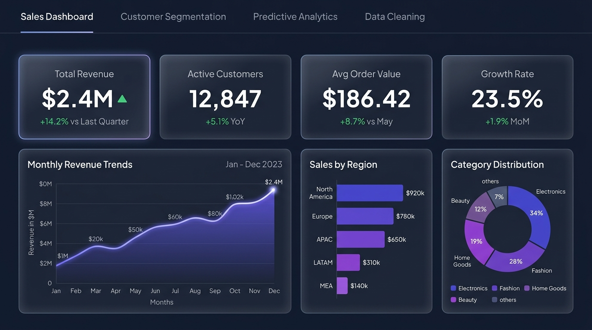
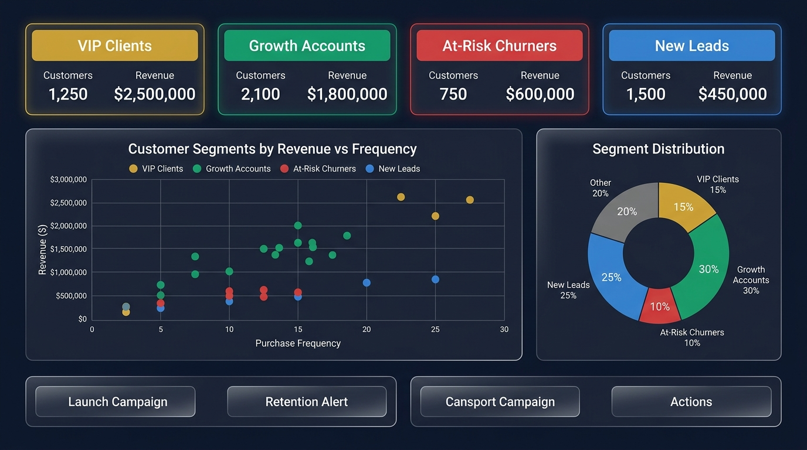
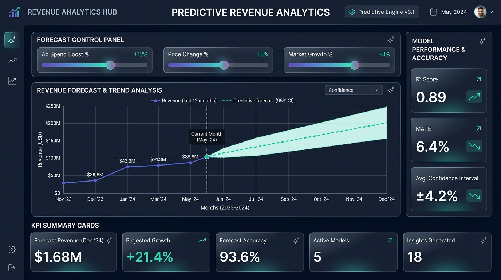
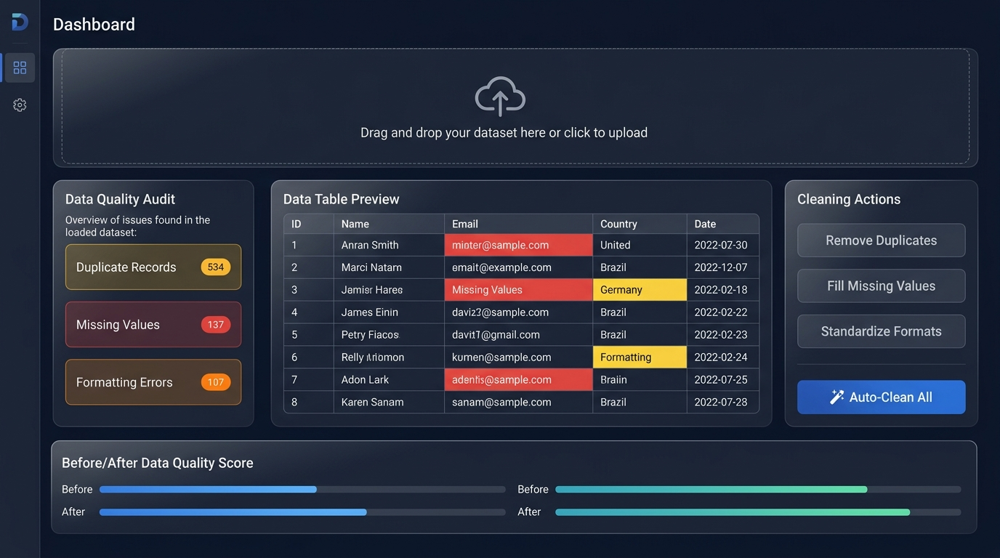

<p align="center">
  
</p>

<h1 align="center">📊 Sales Revenue Tracking System>

<p align="center">
  <b>An enterprise-grade, interactive data analytics platform built with React & Recharts</b>
</p>

<p align="center">
  <a href="https://vkushwaha-07.github.io/Data-Analytics-Project/">
    
  </a>
</p>

<p align="center">
  
  
  
  
  
  
  
  
</p>

---

## 🎯 About The Project

A **modern, full-featured data analytics dashboard** that transforms raw business data into actionable insights through beautiful visualizations, predictive modeling, and automated data cleaning. Built as part of a **Data Analytics Internship** to demonstrate real-world analytics capabilities.

> **Why this project?**  
> Businesses generate massive amounts of data daily — sales records, customer interactions, revenue streams. This platform consolidates everything into a **single, interactive dashboard** that helps stakeholders make data-driven decisions at a glance.

---

## ✨ Features

| Module | Description |
|--------|-------------|
| 📈 **Sales Dashboard** | Real-time revenue tracking, profit margins, order volumes, and regional performance analytics with interactive filters |
| 👥 **Customer Segmentation** | AI-powered customer clustering into VIP, Growth, At-Risk, and New Lead segments with scatter plot visualization |
| 🔮 **Predictive Analytics** | Revenue forecasting with adjustable parameters (Ad Spend, Pricing, Market Growth) and model accuracy metrics |
| 🧹 **Data Cleaning** | Automated detection & fixing of duplicates, missing values, and formatting inconsistencies with CSV/Excel import support |

---

## 📸 Dashboard Screenshots

### 🏠 Sales & Revenue Dashboard
> Track total revenue, net profit, order volumes, and average order value (AOV) — filter by region and product category in real-time.



### 👥 Customer Segmentation
> Segment customers into actionable groups using scatter plot clustering — identify VIP clients, growth accounts, at-risk churners, and new leads.



### 🔮 Predictive Analytics
> Forecast future revenue with interactive sliders — adjust ad spend, pricing strategy, and market growth to simulate different business scenarios.



### 🧹 Data Cleaning & Automation
> Upload CSV/Excel files and auto-detect data quality issues — remove duplicates, fill missing values, and standardize formats with one click.



---

## 🛠️ Tech Stack

<table>
  <tr>
    <td align="center" width="96">
      
      <br><b>React 18</b>
    </td>
    <td align="center" width="96">
      
      <br><b>Vite 5</b>
    </td>
    <td align="center" width="96">
      
      <br><b>Tailwind</b>
    </td>
    <td align="center" width="96">
      
      <br><b>JavaScript</b>
    </td>
    <td align="center" width="96">
      
      <br><b>GH Pages</b>
    </td>
  </tr>
</table>

| Category | Technologies |
|----------|-------------|
| **Frontend** | React 18, JSX, Hooks (useState, useMemo) |
| **Build Tool** | Vite 5 (HMR, Fast Bundling) |
| **Styling** | Tailwind CSS 3.4, PostCSS, Custom Glassmorphism |
| **Charts** | Recharts (Area, Bar, Pie, Scatter, Line Charts) |
| **Icons** | Lucide React |
| **Data Processing** | PapaCSV Parser, SheetJS (XLSX) |
| **Fonts** | Plus Jakarta Sans (Google Fonts) |
| **Deployment** | GitHub Pages |

### 🗣️ Languages Used

<p>
  
  
  
  
  
</p>

| Language | Usage |
|----------|-------|
| **JavaScript (ES6+)** | Core application logic, React components, data processing, chart configurations |
| **JSX** | React component templates combining HTML structure with JavaScript logic |
| **HTML5** | Semantic page structure, entry point (`index.html`), meta tags & SEO |
| **CSS3** | Custom styling, Tailwind utility classes, glassmorphism effects, animations |
| **JSON** | Package configuration, dependency management, sample datasets |

---

## 📁 Project Structure

```
Data-Analytics-Project/
│
├── 📄 index.html                  # Entry HTML with meta tags & font imports
├── 📄 package.json                # Dependencies & scripts
├── 📄 vite.config.js              # Vite configuration (base path, port)
├── 📄 tailwind.config.js          # Tailwind theme customization
├── 📄 postcss.config.js           # PostCSS plugins
├── 📄 Start_Data_Analytics.bat    # One-click Windows launcher
│
├── 📂 src/
│   ├── 📄 main.jsx                # React DOM entry point
│   ├── 📄 App.jsx                 # Root component with tab navigation
│   ├── 📄 index.css               # Global styles & custom CSS
│   │
│   ├── 📂 components/
│   │   ├── 📄 Navbar.jsx              # Top navigation bar with tabs
│   │   ├── 📄 SalesDashboard.jsx      # Sales analytics (KPIs, Area/Pie charts, Regional table)
│   │   ├── 📄 CustomerSegmentation.jsx # Customer segments (Scatter/Pie charts, Segment cards)
│   │   ├── 📄 PredictiveAnalytics.jsx  # Revenue forecasting (Line chart, Sliders, Model metrics)
│   │   └── 📄 DataCleaningAutomation.jsx # Data cleaning (File upload, Audit, Auto-fix)
│   │
│   └── 📂 utils/
│       └── 📄 sampleData.js       # Sample datasets for all dashboard modules
│
├── 📂 public/
│   └── 📄 sales-dashboard.html    # Standalone static dashboard version
│
├── 📂 screenshots/                # Dashboard preview images
│   ├── 🖼️ sales-dashboard.jpg
│   ├── 🖼️ customer-segmentation.jpg
│   ├── 🖼️ predictive-analytics.jpg
│   └── 🖼️ data-cleaning.jpg
│
└── 📄 .gitignore                  # Git ignore rules
```

---

## 🚀 Getting Started

### Prerequisites

Make sure you have the following installed:

- **Node.js** (v18 or higher) — [Download here](https://nodejs.org/)
- **npm** (comes with Node.js) or **yarn**
- **Git** — [Download here](https://git-scm.com/)

### Installation

1. **Clone the repository**
   ```bash
   git clone https://github.com/vKushwaha-07/Data-Analytics-Project.git
   ```

2. **Navigate to the project directory**
   ```bash
   cd Data-Analytics-Project
   ```

3. **Install dependencies**
   ```bash
   npm install
   ```

4. **Start the development server**
   ```bash
   npm run dev
   ```

5. **Open in browser**
   ```
   http://localhost:5175/Data-Analytics-Project/
   ```

### 🪟 Windows Quick Launch

Simply double-click the `Start_Data_Analytics.bat` file to auto-install dependencies and launch the dashboard!

---

## 📊 Key Analytics Modules

### 1. Sales & Revenue Dashboard
- **4 KPI Cards** — Total Revenue, Net Profit, Total Orders, Avg Order Value
- **Revenue & Profit Trajectory** — Dual area chart with gradient fills
- **Revenue by Category** — Donut chart (Electronics, SaaS, Software, Hardware)
- **Regional Performance Table** — Growth rates, margins, and status by region
- **Interactive Filters** — Filter by Region (North America, Europe, Asia Pacific) and Category

### 2. Customer Segmentation
- **4 Segment Cards** — VIP Clients, Growth Accounts, At-Risk Churners, New Leads
- **Scatter Plot** — Customer distribution by Revenue vs Purchase Frequency
- **Segment Distribution** — Donut chart showing customer composition
- **Action Recommendations** — Targeted campaign suggestions per segment

### 3. Predictive Analytics
- **Interactive Forecast Sliders** — Ad Spend Boost %, Price Change %, Market Growth %
- **Historical vs Forecast Chart** — Line chart comparing actual data with AI predictions
- **Model Accuracy Metrics** — R² Score, MAPE, Confidence Interval
- **Dynamic Scenario Simulation** — Real-time forecast updates as parameters change

### 4. Data Cleaning & Automation
- **File Upload** — Drag & drop CSV/Excel files for instant analysis
- **Data Quality Audit** — Auto-detect duplicates, missing values, format errors
- **One-Click Auto-Clean** — Remove duplicates, fill gaps, standardize formats
- **Export Clean Data** — Download cleaned dataset as CSV
- **Before/After Quality Score** — Visual comparison of data quality improvement

---

## ⚙️ Available Scripts

| Command | Description |
|---------|-------------|
| `npm run dev` | Start development server with HMR |
| `npm run build` | Build for production (outputs to `dist/`) |
| `npm run preview` | Preview the production build locally |
| `npm run lint` | Run ESLint to check code quality |

---

## 🌐 Deployment

This project is deployed on **GitHub Pages**. The Vite config is pre-configured with the correct base path:

```js
// vite.config.js
export default defineConfig({
  base: '/Data-Analytics-Project/',
  // ...
})
```

To deploy your own version:
```bash
npm run build
# Push the dist/ folder to gh-pages branch
```

---

## 🎨 Design Philosophy

- **Dark Theme** — Slate-950 background with carefully chosen contrast ratios
- **Glassmorphism** — Frosted glass card effects with subtle borders
- **Micro-Animations** — Hover scale effects, smooth transitions, and gradient glows
- **Responsive** — Fully responsive across desktop, tablet, and mobile
- **Typography** — Plus Jakarta Sans for a modern, professional feel
- **Color Palette** — Indigo, Purple, Pink, Emerald accents on dark backgrounds

---

## 🤝 Contributing

Contributions are what make the open-source community amazing! Any contributions you make are **greatly appreciated**.

1. Fork the Project
2. Create your Feature Branch (`git checkout -b feature/AmazingFeature`)
3. Commit your Changes (`git commit -m 'Add some AmazingFeature'`)
4. Push to the Branch (`git push origin feature/AmazingFeature`)
5. Open a Pull Request

See [`CONTRIBUTING.md`](./CONTRIBUTING.md) for detailed guidelines.

---

## 📄 License

Distributed under the **MIT License**. See [`LICENSE`](./LICENSE) for more information.

---

## 👤 Author

<table>
  <tr>
    <td align="center">
      <a href="https://github.com/vKushwaha-07">
        
        <br />
        <sub><b>vKushwaha-07</b></sub>
      </a>
    </td>
  </tr>
</table>

- **GitHub** — [@vKushwaha-07](https://github.com/vKushwaha-07)

---

## ⭐ Show Your Support

If you found this project helpful, please consider giving it a **⭐ star** on GitHub — it helps a lot!

<p align="center">
  <a href="https://github.com/vKushwaha-07/Data-Analytics-Project">
    
  </a>
</p>

---

<p align="center">
  Built with ❤️ by <a href="https://github.com/vKushwaha-07">vKushwaha-07</a> | 
  Data Analytics Internship Project 2026
</p>
